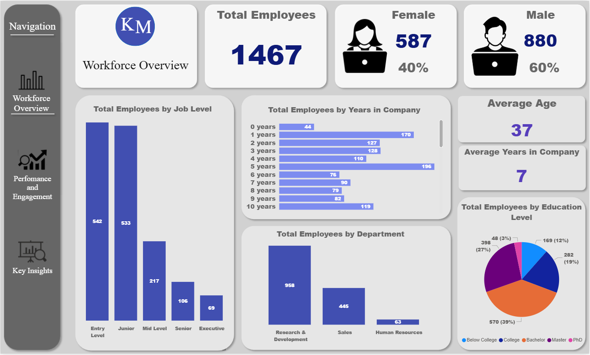
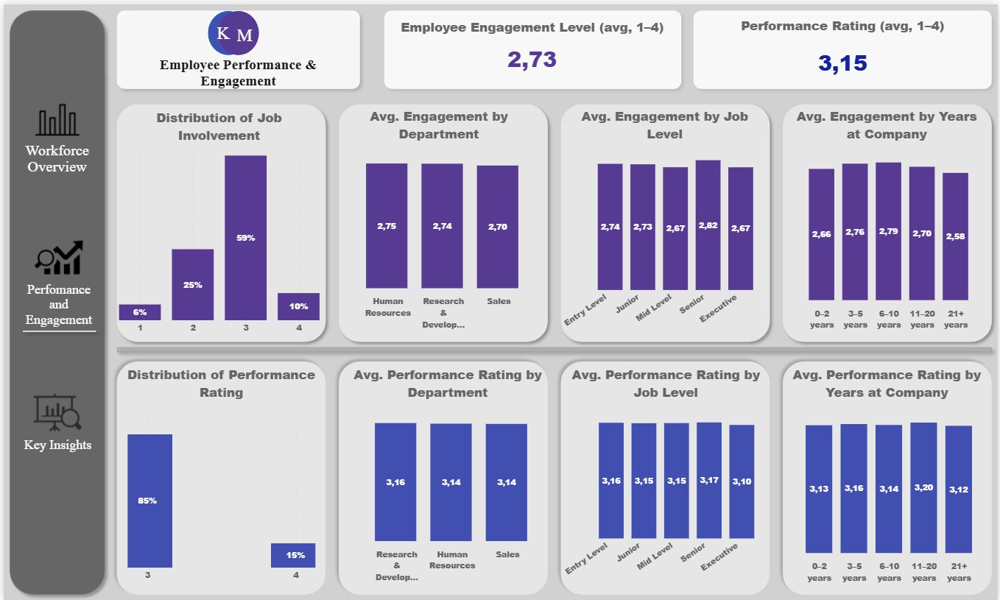
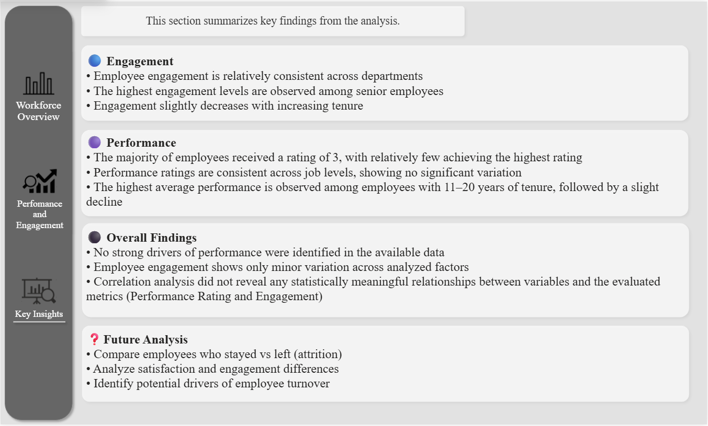

# HR-Analytics-Project
HR analytics project using Power BI

This project explores factors influencing employee performance and job involvement using HR data.  
The goal was to identify potential drivers of employee effectiveness and engagement and present findings through an interactive Power BI dashboard.

## Dashboard Preview

### Workforce Overview

### Performance & Engagement

### Key Insights

## Objectives
- Analyze factors related to **Performance Rating** and **Job Involvement**  
- Identify potential relationships between variables  
- Compare results across:
  - Department  
  - Job Level  
  - Years at Company  
- Explore distribution patterns of key metrics  

## Dataset
- Source: Mendeley Data  
- DOI: 10.17632/smypp8574h.1  
- License: CC BY 4.0  

## 🛠 Tools Used
- Power BI (Power Query) – data cleaning  
- Power BI – data modeling and visualization  
- DAX – measures and calculations  

## Dashboard Overview
The report consists of three main sections:

### 1. Workforce Overview
- Employee distribution by department, job level, and tenure  
- Gender structure  
- Key summary metrics  

### 2. Performance & Engagement Analysis
- Distribution of performance and involvement scores  
- Comparison across organizational dimensions  
- Group-level averages  

### 3. Key Insights
- Summary of analytical findings  
- Interpretation of results  
- Suggestions for further analysis  

## Key Findings
- No statistically meaningful correlations were identified between:
  - Performance Rating and other variables  
  - Job Involvement and other variables  
- Employee performance is relatively stable across analyzed groups  
- Job involvement shows minor variation, slightly higher among senior employees  
- No clear drivers of performance or engagement were identified  

## Limitations
- Limited variability in performance ratings (mostly 3 and 4)  
- Lack of detailed dataset documentation  
- No statistically significant relationships detected  

## Future Analysis
Further analysis could focus on:
- Differences between employees who stayed and those who left (attrition)  
- Relationships between satisfaction metrics and employee turnover  
- Identifying early indicators of attrition  

## Documentation

Full project documentation:  
[Download PDF](HR%20Analytics%20Project%20–%20Documentation.pdf)

## Power BI File

Download the report:  
[Download PBIX](HR%20Analytics%20Project.pbix)

## Use of AI Tools
AI tools were used as a supporting element in the project, including:
- structuring documentation  
- validating analytical approaches  
- comparing decisions with similar use cases  
All key analytical decisions and interpretations were performed independently.

##  Project Status
Completed – ready for portfolio presentation
